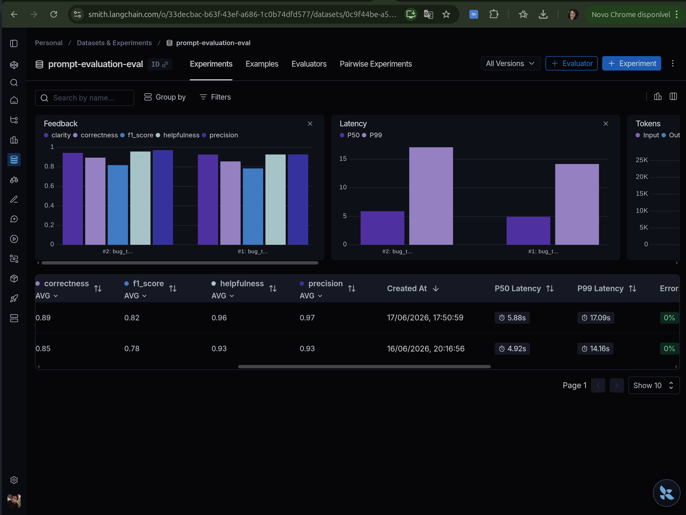
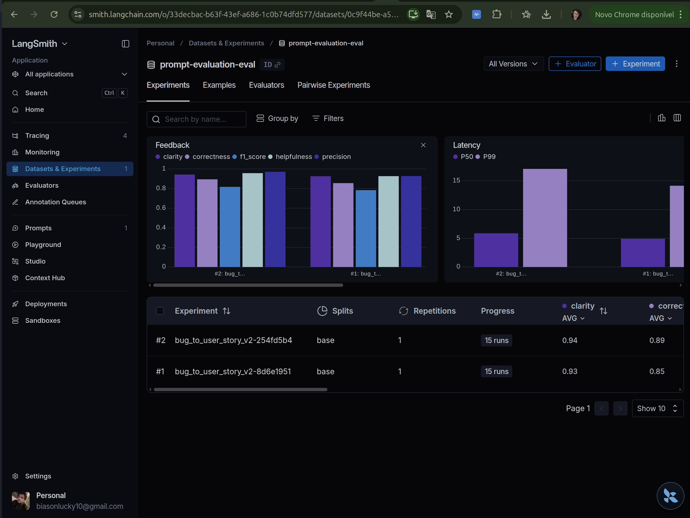

# Pull, Otimização e Avaliação de Prompts com LangChain e LangSmith

Tech Challenge — MBA Engenharia de Software com IA (Full Cycle).
Software que faz **pull** de um prompt de baixa qualidade do LangSmith Prompt Hub,
**otimiza** com técnicas de Prompt Engineering, faz **push** da versão otimizada e
**avalia** a qualidade por 5 métricas (LLM-as-Judge), buscando a nota mínima em todas.

- Prompt otimizado (público): `lucasbiason/bug_to_user_story_v2`
- Caso de uso: converter relatos de bug em **User Stories** ágeis (formato "Como um... eu quero... para que...") com Critérios de Aceitação em Gherkin.

---

## Como Executar

### Pré-requisitos

- Python 3.9+
- Conta no [LangSmith](https://smith.langchain.com) (API key)
- Chave de LLM: **Google Gemini** (`AIza...`, free tier) — provider padrão — ou OpenAI

### 1. Ambiente

```bash
python3 -m venv venv
source venv/bin/activate            # Windows: venv\Scripts\activate
pip install -r requirements.txt
```

### 2. Configuração (`.env`)

Copie `.env.example` para `.env` e preencha:

```bash
LANGSMITH_API_KEY=lsv2_...
USERNAME_LANGSMITH_HUB=seu_handle   # handle público do LangSmith (ex.: lucasbiason)
GOOGLE_API_KEY=AIza...
LLM_PROVIDER=google
LLM_MODEL=gemini-2.5-flash          # gera as respostas
EVAL_MODEL=gemini-2.5-flash         # juiz das métricas
```

### 3. Fluxo (na ordem)

```bash
python src/pull_prompts.py      # 1. baixa o prompt original (leonanluppi/bug_to_user_story_v1)
# 2. otimização: editar prompts/bug_to_user_story_v2.yml (já feito)
python src/push_prompts.py      # 3. publica o v2 no Hub
python src/evaluate.py          # 4. avalia (5 métricas) e imprime APROVADO/REPROVADO
pytest tests/test_prompts.py    # 5. testes de validação do prompt (6)
```

Extra (avaliação nativa no LangSmith, gera um **Experiment/dashboard** na UI):

```bash
python scripts/langsmith_eval.py            # avalia o v2 e registra um Experiment no dataset
python scripts/langsmith_eval.py --prompt leonanluppi/bug_to_user_story_v1   # baseline v1
```

---

## Técnicas Aplicadas (Fase 2)

Escolhi três técnicas para reescrever o prompt: Few-shot Learning (a obrigatória), mais Role
Prompting e Chain of Thought. Também separei bem o System Prompt (persona, regras e exemplos)
do User Prompt, que carrega só o relato a converter (`{bug_report}`).

### Role Prompting

Comecei dando uma identidade clara ao modelo, porque um prompt sem papel definido responde de
forma genérica e inconsistente. O System Prompt abre como um Product Manager sênior especializado
em metodologias ágeis:

> "Você é um Product Manager sênior especializado em metodologias ágeis (Scrum/Kanban)..."

Junto com a persona, criei uma regra de ator que muda conforme o bug: quando o problema afeta
o usuário final, a story usa uma persona humana específica ("um cliente usando o Safari");
quando é backend ou integração, vira "Como o sistema...". Isso segue o jeito que as
referências do dataset escrevem o ator.

### Chain of Thought (interno)

Analisar um bug exige pensar em quem é afetado, o que precisa funcionar, qual o valor e quais
critérios cobrir. Então peço ao modelo que raciocine nessa ordem (ator → ação → valor →
critérios), mas internamente: a resposta final traz só a User Story, sem o raciocínio no meio.
Esse detalhe fez diferença, porque qualquer texto extra derrubava as notas de Clarity e Precision.

### Few-shot Learning (obrigatória)

Exemplos prontos ancoram formato e nível de detalhe muito melhor do que qualquer instrução.
Coloquei três pares de entrada → saída no prompt, cobrindo os tipos de relato que aparecem no
dataset:

1. Usuário final, bug simples — botão "Salvar" do perfil que não grava.
2. Painel/admin — total de relatórios que só atualiza ao recarregar a página.
3. Sistema, com seção "Critérios Técnicos" — cálculo de frete somando errado com vários itens.

De propósito, nenhum desses três é um item do conjunto de avaliação. Usei casos novos para
fixar o padrão sem decorar as respostas que vão ser cobradas (explico isso melhor em
[docs/processo-de-otimizacao.md](docs/processo-de-otimizacao.md)).

Além das técnicas, o prompt atende o resto do que o enunciado pede: regras explícitas de
comportamento, formato obrigatório (Markdown + Gherkin em pt-BR), tratamento de edge cases
(relato vago, vários problemas no mesmo texto, permissão e performance) e acentuação correta.

---

## Resultados Finais

Resultado final: **APROVADO** na configuração oficial do desafio (gemini-2.5-flash gerando e
julgando), com as cinco métricas acima de 0.8 e média **0.9170**. O caminho rodada a rodada
até chegar aqui está em [docs/processo-de-otimizacao.md](docs/processo-de-otimizacao.md).

### Comparativo v1 (baseline) → v2 (otimizado)

| Métrica     | v1 (baseline)\* | v2 (otimizado)        |
| ----------- | --------------- | --------------------- |
| Helpfulness | ~0.45           | 0.96 ✓                |
| Correctness | ~0.52           | 0.89 ✓                |
| F1-Score    | ~0.48           | 0.82 ✓                |
| Clarity     | ~0.50           | 0.95 ✓                |
| Precision   | ~0.46           | 0.97 ✓                |
| **Média**   | ~0.48           | **0.9170 — APROVADO** |

\* O v1 é propositalmente simples (sem persona, sem exemplos, instruções genéricas). Os números
da coluna v1 são os de referência do enunciado e mostram o ponto de partida.

A nota mínima do desafio é 0.8 em cada uma das cinco métricas — o repositório base baixou esse
corte de 0.9 para 0.8 no PR #16. O `evaluate.py` valida com `all(score >= 0.8)` e ainda confere
a média. Saída da rodada final:

```
==================================================
Prompt: lucasbiason/bug_to_user_story_v2
==================================================

Métricas Derivadas:
  - Helpfulness: 0.96 ✓
  - Correctness: 0.89 ✓

Métricas Base:
  - F1-Score: 0.82 ✓
  - Clarity: 0.95 ✓
  - Precision: 0.97 ✓

--------------------------------------------------
MÉDIA GERAL: 0.9170
--------------------------------------------------

STATUS: APROVADO - Todas as métricas >= 0.8
```

### Dashboard público no LangSmith

- Prompt publicado: `lucasbiason/bug_to_user_story_v2` (LangSmith → Prompts).
- Dataset de avaliação: `prompt-evaluation-eval`, 15 exemplos (LangSmith → Datasets).
- Traces de cada execução: projeto `prompt-evaluation` (LangSmith → Projects).
- Experiment com as notas por exemplo: [abrir no LangSmith](https://smith.langchain.com/o/33decbac-b63f-43ef-a686-1c0b74dfd577/datasets/0c9f44be-a52b-4fee-8e92-136467e8ba7c/compare?selectedSessions=b3b9c702-df0e-4f6a-83cf-c364710b861c).

### Screenshots

Avaliação registrada como Experiment no LangSmith via `scripts/langsmith_eval.py` (dataset
`prompt-evaluation-eval`, aba Experiments). As cinco métricas ficam acima de 0.8; pequenas variações
em relação à saída do terminal acima vêm da não-determinância do modelo no free tier:





### Sobre a variação do F1

Quatro das cinco métricas passam tranquilas. O F1 é o único que oscila perto de 0.8, porque no
free tier o juiz também é o gemini-2.5-flash, que é um modelo "thinking" e não-determinístico —
cheguei a ver a mesma saída receber 0.46 numa rodada e quase 1.00 em outra. Para não depender
disso, validei o mesmo prompt com o gpt-4o como juiz (mais rígido e estável): média 0.8235, com
quatro métricas passando e o F1 em 0.75. Os detalhes estão em
[docs/processo-de-otimizacao.md](docs/processo-de-otimizacao.md).

---

## Estrutura do projeto

```
├── prompts/
│   ├── bug_to_user_story_v1.yml   # prompt original de baixa qualidade (pull do Hub)
│   └── bug_to_user_story_v2.yml   # prompt otimizado (Role + CoT + Few-shot)
├── datasets/bug_to_user_story.jsonl   # 15 bugs (não alterar)
├── src/
│   ├── pull_prompts.py            # implementado — pull do v1
│   ├── push_prompts.py            # implementado — push público do v2 (idempotente)
│   ├── evaluate.py                # pronto — avaliação (5 métricas)
│   ├── metrics.py                 # pronto — métricas LLM-as-Judge
│   └── utils.py                   # pronto — helpers / LLM factory
├── scripts/langsmith_eval.py      # extra — Experiment/dashboard nativo no LangSmith
├── tests/test_prompts.py          # implementado — 6 testes de validação
└── docs/
    ├── processo-de-otimizacao.md  # rodadas de teste e resultados
    └── img/                       # screenshots das evidências
```
